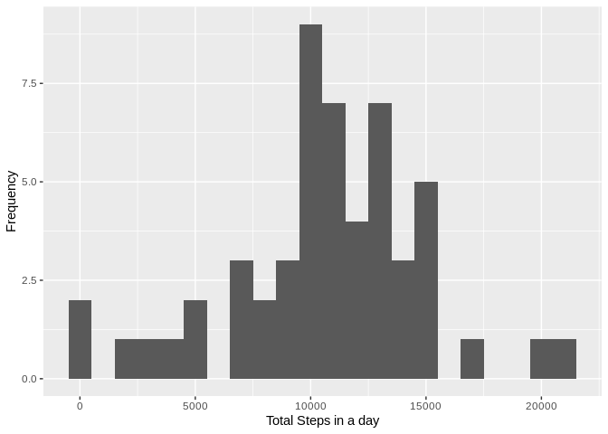
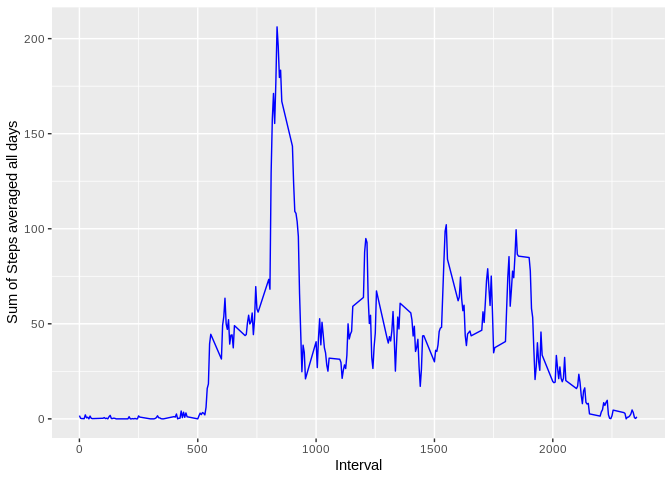
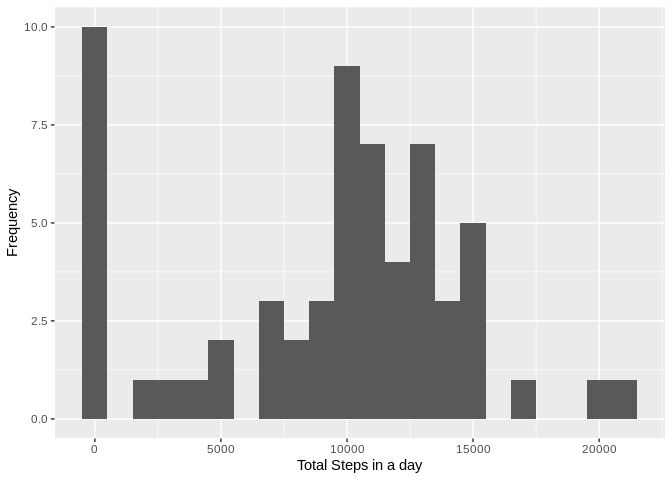
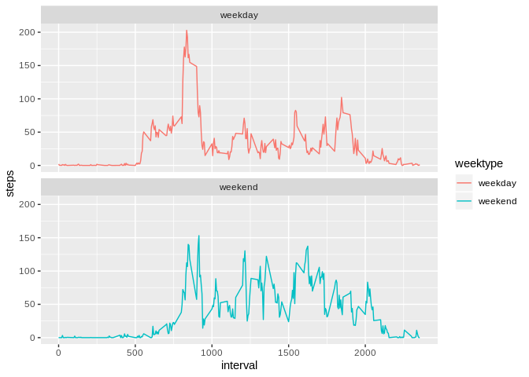

# Reproducible Research - Asssignment 1


## Loading and preprocessing the data


```
## 
## Attaching package: 'dplyr'
```

```
## The following objects are masked from 'package:stats':
## 
##     filter, lag
```

```
## The following objects are masked from 'package:base':
## 
##     intersect, setdiff, setequal, union
```

Load the CSV file to variable


```r
if(!file.exists('activity.csv')) {
    unzip('activity.zip')
}
activityData <- read.csv('activity.csv')
```


## What is mean total number of steps taken per day?

### Calculate the total number of steps taken per day.


```r
sumOfStepsByDay <- activityData %>%
    filter(!is.na(steps)) %>%
    group_by(date) %>%
    summarize(steps = sum(steps))  
```

Note: 
NA values have been ignored in this histogram as per instruction (and therefore removed from the data in this section)

### Histogram of total number of steps taken each day.


```r
qplot(sumOfStepsByDay$steps,
      geom="histogram", 
      xlab="Total Steps in a day", 
      ylab="Frequency", 
      binwidth=1000)
```

<!-- -->

The takeaway from this graph is really only that a median number of steps was achieved most often based on measurements of this data.

### Calculation of the mean and median of the total number of steps per day

```r
sumOfStepsByDayMean <- mean(sumOfStepsByDay$steps)
sumOfStepsByDayMedian <- median(sumOfStepsByDay$steps)
```

The mean steps per day was 1.0766189\times 10^{4}.
The median steps per day was 10765.

## What is the average daily activity pattern?

### Time series plot of average number of steps taken across all days

I used dplyr to calculate the average over interval values.


```r
sumOfStepsByIntervalAveraged <- activityData %>%
    filter(!is.na(steps)) %>%
    group_by(interval) %>%
    summarize(steps=mean(steps))  

qplot(x = sumOfStepsByIntervalAveraged$interval, 
      y = sumOfStepsByIntervalAveraged$steps, 
      geom="line", 
      col=I("blue"), 
      xlab="Interval", 
      ylab="Sum of Steps averaged all days")
```

<!-- -->

### Which 5 minute interval on average contains the most steps?
Using dplyr, we can filter the data used in the previous plot to show the interval with the maximum average steps.


```r
intervalWithMostSteps <- sumOfStepsByIntervalAveraged %>% filter(steps==max(steps))
```

The interval with the most steps is 835.

## Imputing missing values

### Calculating the total number of missing values

```r
totalMissingValues <- sum(is.na(activityData$steps))
```

Total missing values is 2304.

### Strategy for imputing missing values

As seen above, there are 2304 missing steps values in the data.  To cater for this fact and take into account the unrecorded values here, the strategy I'm using is to insert the average steps for that day into the data records with missing values.  

This strategy is fairly simplistic but over a large volume of data it might work out better.

Note also, some days do not have ANY valid data, therefore a mean cannot be calculated.  In these cases, the mean was assumed to be 0 and therefore the NA values were also replaced by 0 (for lack of further information at the granularity of those days).

### Creating a new dataset from original with missing data filled in.

```r
activityDataImputed <- activityData %>%
    group_by(date) %>%
    mutate(
        steps=
            ifelse(
                is.na(steps),
                ifelse(
                    !is.finite(mean(steps,na.rm=TRUE)),
                    0,
                    mean(steps,na.rm=TRUE)
                ) ,
            steps)) %>%
    as.data.frame()
```

### Histogram of total number of steps taken each day with mean and median by day.

```r
sumOfStepsByDayImputed <- activityDataImputed %>%
    group_by(date) %>%
    summarize(steps = sum(steps))  

sumOfStepsByDayMeanImputed <- mean(sumOfStepsByDayImputed$steps)
sumOfStepsByDayMedianImputed <- median(sumOfStepsByDayImputed$steps)

qplot(sumOfStepsByDayImputed$steps,
    geom="histogram", 
    xlab="Total Steps in a day", 
    ylab="Frequency", 
    binwidth=1000)
```

<!-- -->

The biggest difference in the histogram appears to be a spike in the number of steps in an earlier histogram bucket.

The mean steps per day was 9354.2295082.
The median steps per day was 1.0395\times 10^{4}.

The mean and the median have also taken a fall due to the number of days in which no data was collected and therefore steps taken was assumed to be 0.

## Are there differences in activity patterns between weekdays and weekends?

### Create a new factor variable with 2 levels weekday and weekend
I had some trouble with the weekdays() function since it was displaying named weekdays in my local language which may not be reproducible on other machines if comparing to text strings like "Saturday" to "Samstag".
Therefore, I used an alternate method by getting the number of the day of the week. :)


```r
activityDataImputed$dayNumber = 
    as.integer(
        format(
            as.Date(activityDataImputed$date),
            "%w"
        )
    )

activityDataImputed$weektype <- 
    ifelse(activityDataImputed$dayNumber %in% c(0,6),
           "weekend",
           "weekday")
```

### Make a panel plot showing average steps taken for weekdays/weekends
The differences in activity for weekedays and weekends shows that the subject(s) are more active overall on the weekends on average, however, there is a large spike at a similar time during weekdays with more steps (possibly morning exercise or walking to work).

```r
activityDataImputedWithIntervalAverage <- 
    activityDataImputed %>%
    group_by(weektype,interval) %>%
    summarise(steps=mean(steps))

plot <- ggplot(activityDataImputedWithIntervalAverage,  
    aes(x=interval,y=steps,color=weektype)) +
    geom_line() +
    facet_wrap(~weektype,ncol=1,nrow=2)
print(plot)
```

<!-- -->
